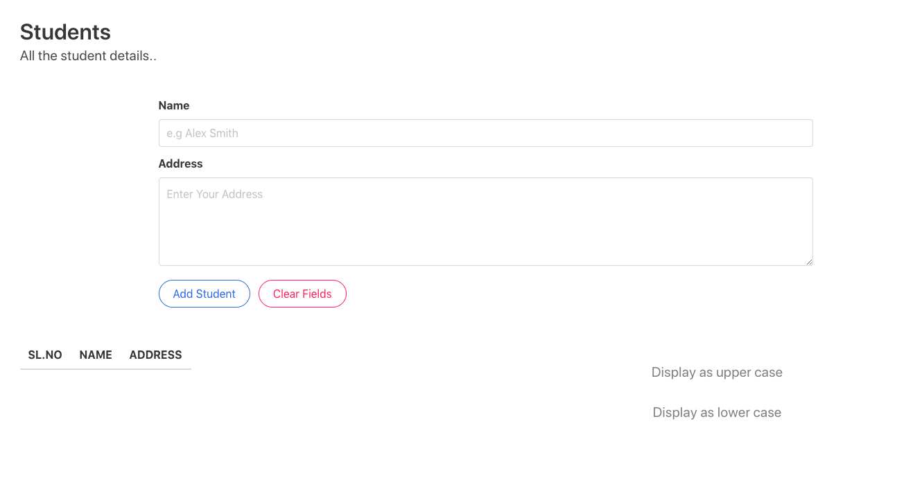

# RESTful API using Node.js and Client Application

## Contents
- A RESTful API which has to endpoints to convert strings to capital letters and small letters
- A client web application which works with the above API

## How to Run

#### Get the Project
```zsh
git clone https://github.com/zidansprofile/WebTech-Assignment-1.git
```

#### Run Web Server
```zsh
cd WebTechnology-Assignment1/server/RESTful API
npm install
npm start
```

#### Run Web Client
- Now open index.html from *WebTechnology-Assignment1/client/public* in a browser

## Screenshot


